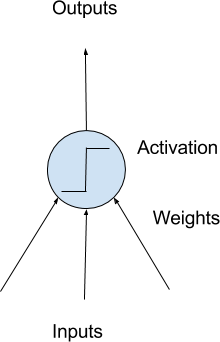
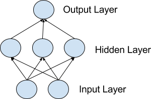

##Keras

Keras is a minimalist, highly modular neural networks library, written in Python and capable of running on top of either TensorFlow or Theano.

>This repo will serve as a guide I wish I had, while starting out Keras.

###Index

0. Just enough Deep learning Theory for Keras

1. Keras's approach to solve Deep Learning Problems

2. Coding in Keras

3. Keras API - Just enough

4. Keras Layers

5. Network/Model Design and Architecture

6. Vision/Image Problems with Keras

7. Text/NLP Problems with Keras

8. Levelling up to solving actual Deep Learning Problems

9. Up and running with Kears - really quick.

10. Setting up locally on Ubuntu 14.04

11. Running  Keras on a AWS GPU instance

12. Keras - Configurations


######################################################################################

###0. Just enough Deep learning Theory for Keras

Deep learning is a fascinating field. Artificial neural networks have been around for a long time, but something special has happened in recent years. The mixture of new faster hardware, new techniques and highly optimized open source libraries allow very large networks to be created with frightening ease.

Unlike R, Python is a fully featured programming language allowing you to use the same libraries and code for model development as you can use in production. Unlike Java, Python has the SciPy stack for scientific computing and scikit-learn which is a professional grade machine library.

Two of the top numerical platforms in Python that provide the basis for deep learning research and development are Theano and TensorFlow. Both are very powerful libraries, but both can be difficult to use directly for creating deep learning models.

>Where does Keras fit into Theano, Tensorflow and of course deep Learning?

Keras is a minimalist Python library for deep learning that can run on top of Theano or TensorFlow. It is a wrapper library that hides Theano completely and provides a very simple API to work with to create deep learning models.

It hides Theano so well, that it can in fact run as a wrapper for another popular foundation framework called TensorFlow.

It was developed to make developing deep learning models as fast and easy as possible for research and development. It runs on Python 2.7 or 3.5 and can seamlessly execute on GPUs and CPUs given the underlying frameworks.

It is released under the permissive MIT license. Keras was developed and maintained by Francois Chollet, a Google engineer

Keras wraps both the TensorFlow and Theano libraries, abstracting their capabilities and hiding their complexity.Keras is designed for minimalism and modularity allowing you to very quickly define deep learning models.

Keras is compatible with: Python 2.7-3.5.

######Perceptron
A Perceptron is a single neuron model that was a precursor to larger neural networks.

######Multilayer Perceptrons
The field of artificial neural networks is often just called Neural Networks or Multilayer Perceptrons after perhaps the most useful type of neural network.

######Neurons
The building block for neural networks are artificial neurons. These are simple computational units that have weighted input signals and produce an output signal using an activation function.



######Neuron Weights
You may be familiar with linear regression, in which case the weights on the inputs are very much like the coefficients used in a regression equation. Like linear regression, each neuron also has a bias which can be thought of as an input that always has the value 1.0 and it too must be weighted. For example, a neuron may have two inputs in which case it requires three weights. One for each input and one for the bias.

######Activation
The weighted inputs are summed and passed through an activation function, sometimes called a transfer function. An activation function is a simple mapping of summed weighted input to the output of the neuron. It is called an activation function because it governs the threshold at which the neuron is activated and the strength of the output signal.

######Networks of Neurons
Neurons are arranged into networks of neurons. A row of neurons is called a layer and one network can have multiple layers. The architecture of the neurons in the network is often called the network topology. Which are a combination of input layer, output layer and hidden layer.





######Input or Visible Layers
Given increases in computing power and efficient libraries, very deep neural networks can be constructed. Deep learning can refer to having many hidden layers in your neural network. They are deep because they would have been unimaginably slow to train historically, but may take seconds or minutes to train using modern techniques and hardware.

######Hidden Layers
Layers after the input layer are called hidden layers because they are not directly exposed to the input.

######Output Layer
The final hidden layer is called the output layer and it is responsible for outputting a value or vector of values that correspond to the format required for the problem. The choice of activation function in the output layer is strongly constrained by the type of problem that you are modeling.

######################################################################################

###1. Keras's approach to solve Deep Learning Problems

>The ideas behind deep learning are simple, so why should their implementation be painful?

>Models can be built up like Lego.

Guiding principles:

* Modularity: A model can be understood as a sequence or a graph alone. All the concerns of a deep learning model are discrete components that can be combined in arbitrary ways.
* Minimalism: The library provides just enough to achieve an outcome, no frills and maximizing readability.
* Extensibility: New components are intentionally easy to add and use within the frame- work, intended for developers to trial and explore new ideas.
* Python: No separate model files with custom file formats. Everything is native Python.

Keras deep learning models can be developed using an idiom of defining, compiling and fitting models that can then be evaluated or used to make predictions.

Use Keras if you need a deep learning library that:

• Allows for easy and fast prototyping (through total modularity, minimalism, and extensibility).
• Supports both convolutional networks and recurrent networks, as well as combinations of the two.
• Supports arbitrary connectivity schemes (including multi-input and multi-output training).
• Runs seamlessly on CPU and GPU.

What does Keras help you achieve ?

- Design, test, and redesign a deep learning pipeline quickly and easily, even if you're not a neural network specialist

- Avoid the complexity of floating point operations, GPU programming, and linear algebra

######################################################################################
###2. Coding in Keras

The core data structure of Keras is a model, a way to organize layers. The main type of model is the Sequential model, a linear stack of layers.

Here's the Sequential model:

```python
from keras.models import Sequential
model = Sequential()
```

Stacking layers is as easy as .add():

```python
from keras.layers import Dense, Activation
model.add(Dense(output_dim=64, input_dim=100))
model.add(Activation("relu"))
model.add(Dense(output_dim=10))
model.add(Activation("softmax"))
```

Once your model looks good, configure its learning process with .compile():

```python
model.compile(loss='categorical_crossentropy', optimizer='sgd', metrics=['accuracy'])
```

You can now iterate on your training data in batches:

```python
model.fit(X_train, Y_train, nb_epoch=5, batch_size=32)
```

Or generate predictions on new data:

```python
classes = model.predict_classes(X_test, batch_size=32)
```

So it goes like as
1/ Creating a model (and add necessary layers)
2/ Compiling a model
3/ Fit the model
4/ Test / Predict

######################################################################################

Hello World with Keras


######################################################################################
###3. Keras API - Just enough.

Models, Layers

Model Creation:

```python
model = Sequential()
```

And do

```python
model.add()
```

So, the basic Structure of the model goes like thisDense (<hidden Layers> , <input dimension> )

```python
model = Sequential([ Dense(32, input_dim=784), Activation('relu'), Dense(10),Activation('softmax'), ])
```

Sequential model (a linear pile of layers):

```python
from keras.models import Sequential
from keras.layers.core import Dense, Activation

model = Sequential()
model.add(Dense(output_dim=64, input_dim=100,init="glorot_uniform"))
model.add(Activation("relu"))
model.add(Dense(output_dim=10, init="glorot_uniform"))
model.add(Activation("softmax"))
```

Best practices , standard easy of doing things , Custom stuffs

epochs
Batch size

Parameters (to important methods)
-Compile
-model.add
-Activation
-Dropout
-Optimisers
-Objectives

####Predict

```python
model.predict()
classes = model.predict_classes(X_test, batch_size=32)
proba = model.predict_proba(X_test, batch_size=32)
```

####Training/fit

```python
model.fit(X_train, Y_train, nb_epoch=5, batch_size=32)
model.train_on_batch(X_batch, Y_batch)
model.fit
```

####Evaluation

```python
objective_score = model.evaluate(X_test, Y_test,
batch_size=32)
```

####Load/Save weights Models(to/from a HDF5 file(.h5 extension))

```python
model.save_weights(file path)
model.load_weights(file path)
```

######################################################################################
###4.Keras Layers

Core Layers

Dense
Activation
Dropout
SpatialDropout2D
SpatialDropout3D
Flatten
Reshape
Permute

Convolution Layers
Pooling Layers
Recurrent Layers


